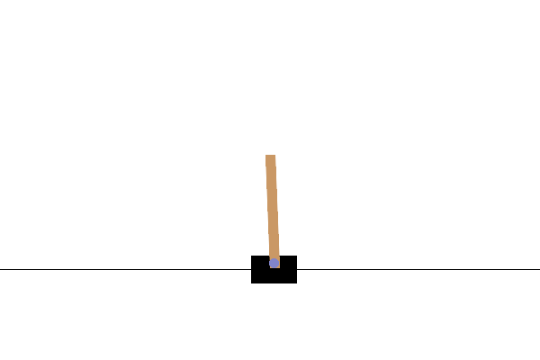

# Policy Gradient for CartPole - Reinforce Algorithm

This project involves implementing a simple reinforcement learning algorithm -- RETINFORCE -- to solve the classic CartPole problem using PyTorch.

The objective is to keep a pole balanced upright on a moving cart. The agent controls the cart by either pushing it left or right, and must learn to maximize the time the pole stays upright.

**Goal:** Agent's task is to keep the pole balanced for as long as possible. If the pole angle exceeds a certain threshold or the cart moves out of bounds, the episode ends.

This project will use PyTorch to build the NN model the represents the policy, which will output a probability disctribution over the actions.

--------------------------------

## Implementation

The CartPole problem was implemented by using two main classes: a PolicyNetwork class, and a REINFORCEAgent class.

**PolicyNetwork class:**

This class is a neural network representing the agent's policy in the REINFORCE algorithm.

The network maps action states to action probabilities, which will define the agent's behavior stategy. For CartPole, it takes a 4D state as input and outputs 2 possible actions (right or left).

Architecture:

- Input: 4 neurons (state space dimensions)
- Hidden Layer: 128 neurons, ReLU activation
- Output: 2 neurons (left or right), Softmax activation

State Space Input:

1. Cart Positionn: -2.4 to +2.4
2. Cart Velocity: -Inf to +Inf
3. Pole Angle: -41.8 degrees to +41.8 degrees
4. Pole Angular Velocity: -Inf to +Inf

**REINFORCEAgent class:**

This class acts as an agent that implements the REINFORCE algorithm (Monte Carlo Gradient) for CartPole.

The REINFORCE algo is a policy gradient method that learns by:

1. Collecting complete episodes using current policy
2. Computing discounted returns for each timestamp
3. Update policy network to increase probabilities that lead to higher returns

Attributes:

    env (gym.Env): Training environment instance
    eval_env (gym.Env): Seperate environment for evaluation, with rendering enabled
    gamma: discount factor for future rewards (0 to 1)
    policy (PolicyNetwork): NN defined earlier
    optimizer: optimizer for policy network updates
    states (list): stores states in current episode
    action_probs (list): stores action log probabilities for current episode.
    rewards (list): stores rewards for a current episode

Methods:

    select_action(self, state): Selects action using current policy.
    calculate_returns(self): Calculates discounted returns fopr each timestep in episode
    update_policy(self): Updates polocy network using REINFORCE algo.
    train(self, num_episodes): Trains the agent using the REINFORCE algo.
    evaluate(self)

This class handles everything from initializing, training, evaluating, loading, and saving the model. This implementation allows for easy client usage with methods to handle everything we need.

The optimizer used for this task was Adam, with a learning rate of 0.01. Several learning rates were tested but this seemed to be the most effective.

To test the performance of the model, please run

        python evaluation.py

This uses a pretrained model, which was training in the cartpole notebook. This notebook also includes more detailed documentation on the implementation process.

## Challenges Faced

The largest challenge faced during this task was unstable training. Calling the REINFORCEAgent.train() method multiple times resulted in largely varying performance.

Some results ended with average rewards nearing 500 (which is the maximum) and other times with average rewards of under 100. 

This is common in REINFORCE training. One step to mitigate this was to set random seeds during initialization for reproducability. I also experimented with increased training time, which also lead to more stable training. In the future, it could be worth implementing a learning rate scheduler to see if this made training more stable.

## Conclusions and Visualization

Despite inconsistent training, we were still able to train a model with near perfect performance. Below is the average rewards per episode:

Example run:

In the example, we see that the CartPole successfully stays upright for the duration of the episode.

Running the evaluation method over 5 episodes, we get the following results:

    Episode 1: Reward = 500.0, Steps = 500
    Episode 2: Reward = 500.0, Steps = 500
    Episode 3: Reward = 500.0, Steps = 500
    Episode 4: Reward = 500.0, Steps = 500
    Episode 5: Reward = 500.0, Steps = 500

    Evaluation Results over 5 episodes:
    Average Reward: 500.00 ± 0.00
    Max Reward: 500.0
    Min Reward: 500.0
    Perfect Episodes: 5/5 (100.0%)
    Performance: 100.0% of maximum possible reward

CartPole Problem = Successfully Solved!